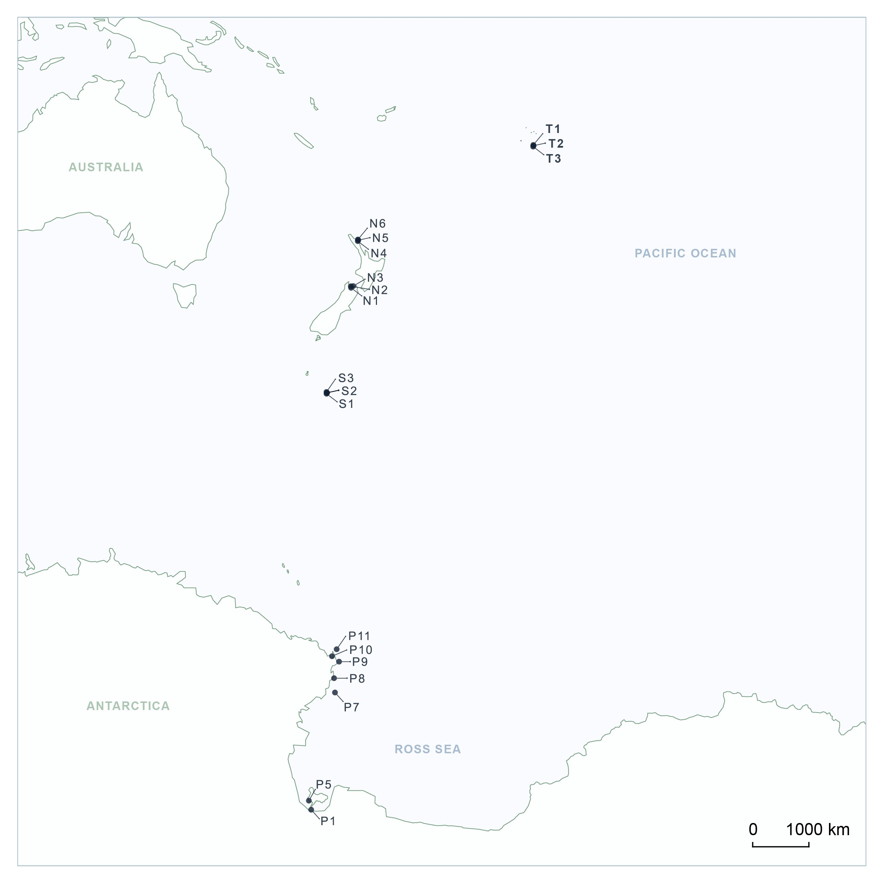

## Background information 
  
##### Tropics to the poles: Diversity and composition of coastal eukaryotic marine microalgae communities across five ecoregions.  
_Authors:_  
Jacqui Stuart (1,2), Ken Ryan (1), Natalie Robinson (4), Svenja Halfter (4), Craig Stewart (4), John K. Pearman (1), 
Jacob Thomson-Laing (2), Kirsty F. Smith (2,3)

_Affiliations:_   
1. School of Biological Sciences, Victoria University of Wellington, PO Box 600, Wellington 6140, New Zealand.  
2.	Cawthron Institute, Private Bag 2, Nelson 7042, New Zealand.  
3.	School of Biological Sciences, University of Auckland, Private Bag 92019, Auckland 1142, New Zealand.  
4.	National Institute of Water and Atmospheric Research (NIWA), Private Bag 14901, Kilbirnie, Wellington 6241  

  
#### Abstract
The objectives of this study are to analyse and compare the community composition and diversity of planktonic marine microalgae in a latitudinal gradient spanning the tropical to polar ecoregions in the South Pacific. This was achieved using eDNA samples and multi-region small subunit rDNA metabarcoding. Our focus was to identify similarities and differences at the functional group level across a large latitudinal gradient and assess diversity.

Samples were collected from sites in tropical, sub-tropical, and temperate ecoregions. All sites were coastal or near shore, without significant rainfall 2-3 days before sampling. All samples from the tropical, sub-tropical and temperate sites were collected in spring, with tropical collected in the spring of 2022 between 28th November – 30th November, sub-tropical and temperate samples collected between 20th October – 29th November 2021, and polar samples were between 10th October to 24th November, respectively. sampling in the polar and sub-polar regions was undertaken in the summer of 2023, and polar sites were sampled via holes in the sea ice, with an additional five open water polar site samples during the National Institute of Water and Atmospheric Research (NIWA) 2023 Tangaroa voyage to the Ross Sea.

***  
  
{width=70%}
  
***  

The community composition of the EMC was divided into taxon-based functional groups: dinoflagellates (Dinophyceae), pennate diatoms (Bacillariophyceae) radial centric diatoms (Coscinodiscophyceae), polar centric diatoms (Mediophyceae), chlorophytes (Chlorodendrophyceae, chlorophyceae, chloropicophyceae, mamiellophyceae, nephroselmidophyceae, pedinophyceae, picocystophyceae, prasinophyceae, pyramimonadophyceae, trebouxiophyceae), haptophytes (Coccolithophyceae, pavlovophyceae, Prymnesiophyceae, Rappephyceae), and ‘Other’ eukaryotic microalgae (Bolidophyceae, chrysophyceae,  dictyochophyceae, eustigmatophyceae, pelagophyceae, pinguiophyceae, raphidophyceae, Synchromophyceae, Euglenida). Taxonomic ranks were identified using the revised classification of eukaryotic groups proposed by Adl et al. (2012), which is also used for taxonomic assignment in the PR2 database. This resolution was based on taxon-based functional divisions used to assess the microalgal community structure (Figure 2; Kruk, 2002; Litchman et al., 2007; Litchman and Klausmeier, 2008; Edwards et al., 2013; Wentzky et al., 2020).  

***  
{width=70%}
  
***
  

## Pipeline Overview

This is the analysis pipeline for my thesis chapter three samples: Tropics to the Poles. It includes:   
1. Rarefaction Curves  
2. Alpha diversity analysis  
3. Beta diversity analysis  
4. Venn diagram analysis  
5. Community composition and  
6. Dendrogram construction  

All analysis are to compare the community composition of coastal marine microalgae from five ecoregions; Tropical, subtropical, temperate, sub-polar and polar. An additional analysis of assembly processes between and within ecoregions was complete, the script for this is in a separate file as production of the map kept causing the markdown file to crash.
  
***
  
