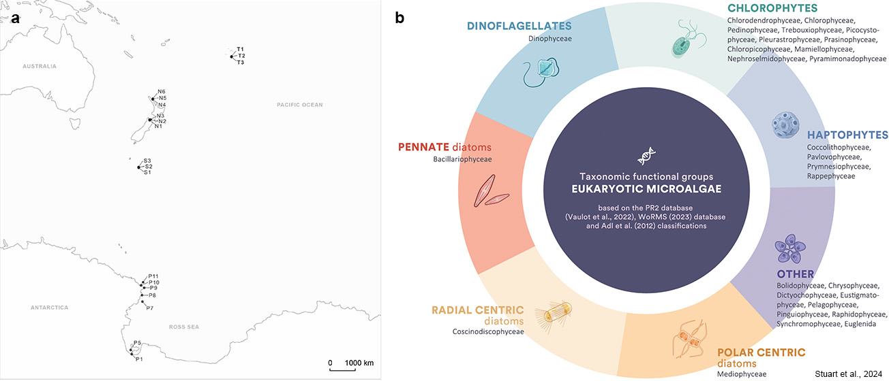

# Tropics to the poles: A Snapshot of Coastal Eukaryotic Marine Microalgae Diversity Across Five Ecoregions.  
__Authors:__  Jacqui Stuart<sup>1, 2</sup>, Ken Ryan<sup>1</sup>, Natalie Robinson<sup>3</sup>, Svenja Halfter<sup>3</sup>, John K. Pearman<sup>1</sup>, 
Jacob Thomson-Laing<sup>2</sup>, Kirsty F. Smith<sup>2</sup>

__Affiliations:__  1) School of Biological Sciences, Victoria University of Wellington, New Zealand; 2) Cawthron Institute, Private Bag 2, Nelson 7042, New Zealand; 3) National Institute of Water and Atmospheric Research (NIWA), Wellington, New Zealand.
***
#### Contents
<p align="left"> 
  <a href="#abstract">Abstract</a>&nbsp;&nbsp;&nbsp;&nbsp;&nbsp; | &nbsp;&nbsp;&nbsp;&nbsp;&nbsp;
  <a href="#script-files">Script files</a>&nbsp;&nbsp;&nbsp;&nbsp;&nbsp; | &nbsp;&nbsp;&nbsp;&nbsp;&nbsp;
  <a href="#metadata-examples">Metadata examples</a>&nbsp;&nbsp;&nbsp;&nbsp;&nbsp; | &nbsp;&nbsp;&nbsp;&nbsp;&nbsp;
  <a href="#r-requirements">R requirements</a> 
</p>

***
   
## Abstract  
The objectives of this study are to analyse and compare the community composition and diversity of planktonic marine microalgae in a latitudinal gradient spanning the tropical to polar ecoregions in the South Pacific. This was achieved using eDNA samples and multi-region small subunit rDNA metabarcoding. Our focus was to identify similarities and differences at the functional group level across a large latitudinal gradient and assess diversity.  
Samples were collected from sites in tropical, sub-tropical, and temperate ecoregions (Figure 1a). All sites were coastal or near shore, without significant rainfall 2-3 days before sampling. All samples from the tropical, sub-tropical and temperate sites were collected in spring, with tropical collected in the spring of 2022 between 28th November – 30th November, sub-tropical and temperate samples collected between 20th October – 29th November 2021, and polar samples were between 10th October to 24th November, respectively. Sampling in the sub-polar regions was undertaken on 14th February 2023, and polar sites were sampled via holes in the sea ice (10th October - 24th November 2022), with an additional five open water polar site samples during the National Institute of Water and Atmospheric Research (NIWA) Tangaroa voyage to the Ross Sea  6th – 11th February 2023.  
The community composition of the EMC was divided into taxon-based functional groups: dinoflagellates, pennate diatoms, radial centric diatoms, polar centric diatoms, chlorophytes, haptophytes, and ‘Other’ eukaryotic microalgae (Figure 1b). Taxonomic ranks were identified using the revised classification of eukaryotic groups proposed by Adl et al. (2012), which is also used for taxonomic assignment in the PR2 database. This resolution was based on taxon-based functional divisions used to assess the microalgal community structure (Figure 1b; Kruk, 2002; Litchman et al., 2007; Litchman and Klausmeier, 2008; Edwards et al., 2013; Wentzky et al., 2020).    


<sub> <strong>Figure 1.</strong> a) Map depicting sampling sites in tropical, sub-tropical to temperate, sub-polar and polar ecoregions. b) The taxonomic-functional groups of eukaryotic marine microalgae used in this study. The other categories include golden, yellow, and brown classes. Divisions are based on PR2 database classifications (Vaulot et al., 2022), as proposed by Adl et al. (2012), and the World Register of Marine Species (WoRMS 2023) database. Image from Stuart et al., 2024 DOI: [10.1038/s41598-024-56993-4] https://www.nature.com/articles/s41598-024-56993-4) </sub>
<br></br>      
  

***
 [↑ Back to top](#contents)  
<br></br>

# Script Files  
- **Scripts:** R scripts used to process raw metabarcoding files, assign taxonomy, assess microalgal community composition, assembly processes and indicator species across five ecoregions.
  - `Step1_ProcessingMetabarcodingData`: Processing Raw Metabarcoding files
  - `Step2_DataAnalysis_CommunityComp_and_Diversity`: Rarefaction Curves, Alpha diversity analysis, Beta diversity analysis, Venn diagram construction, Community composition, Dendrogram construction and Indicator Species analysis
  - `Step3_DataAnalysis_AssemblyProcess`:  Assembly processes analysis

## Metadata Examples
Below are examples of the types of files and metadata file layouts required for each analysis script:
### Files for `Step1_ProcessingMetabarcodingData` 
__1. Metabarcoding files__
   - File type: `.fastq.gz`
   - Description: this is is a text format that stores raw sequencing reads, including the nucleotide sequences and corresponding per-base quality scores.

__2. Taxonomy files__
   - File type `.rds`
   - Description: An RDS taxonomy file in R stores assigned taxonomic classifications (e.g., Kingdom to Species) for each sequence variant, typically output from tools like DADA2.

__3. Metadata__
   - File type: `.csv`
   - Description: These files are for all the associated data you have related to your samples. This can include `siteID`, `samplingDate`, `sampleID`and other relevant physical site data like temperature, salinity etc.
   

__4. Primer sequences__
   - This is not a file, but during the trimming and cleaning step you will need to know the primer sequences you used to remove these from the resulting sequences. In this study we used:
   ```{r Primer sequences}
   FWD <- "CCCTGCCHTTTGTACACAC" #FORWARD: 1380F v9
   REV <- "CCTTCYGCAGGTTCACCTAC" #REVERSE: 1510R v9
   ```

[↑ Back to top](#contents)  
<br></br>


### Files for `Step2_DataAnalysis_CommunityComp_and_Diversity` 
__1. Cleaned taxonomy files__
  - File Type: `.rds`
  - Description: this file is what you should end up with after running the `Step1_ProcessingMetabarcodingData` script with your raw metabarcoding sequence data.

__2. Site data for dbRDA__
  - File type: `.csv`
  - Description: Here we have the physical data relating to each site used in the distance based redundance analysis (dbRDA).
    


[↑ Back to top](#contents)  
<br></br>

### Files for `Step3_DataAnalysis_AssemblyProcess` 
__1. Sample data__
  - File type: `.rds`
  - Description: If you have run the `Step2_DataAnalysis_CommunityComp_and_Diversity` script, then you will have created a file `waterSamples_pru_rare.rds` at line 485. This is the pre-filtered data that we use for this analysis.
__2. Site data__
  - File type: `.csv`
  - Description: this is a simple .csv file with site co-ordinates only, you can also extract this from your larger data file can create a new dataframe with only the co-ordinate data.

    

***
[↑ Back to top](#contents)  
<br></br>

# R Requirements
The Packages used in these pipelines are as follows.
- Sequence prep and taxonomy: `phyloseq`, `ggplot2`, `ShortRead`, `Biostrings`, `dada2`, `dplyr`
- Data wrangling: `tidyverse`, `dplyr`, `data.table`, `readr`, `tibble`
- Metabarcoding processing: `phyloseq`, `vegan`, `picante`, `indicspecies`, `ape`
- Plotting & visualisation: `ggplot2`, `ggpubr`, `RColorBrewer`, `viridis`
- Multivariate stats: `vegan`, `betapart`, `adespatial`, `ecodist`
- Assembly processes: `picante`, `iCAMP`, `Hmisc`, `zCompositions`, `compositions`
- Others: `knitr`, `rmarkdown`, `here`, `devtools`, `cowplot`, `patchwork`

```{r}
install.packages(c("tidyverse", "phyloseq", "vegan", "picante", "indicspecies", 
                   "ggplot2", "pheatmap", "data.table", "cowplot", "patchwork"))
```

Some packages like `iCamp` require `devtools::install_github("Li-Chia-Yu/iCAMP")`. This is specified in the actual scipt files.

***
 [↑ Back to top](#contents)  


